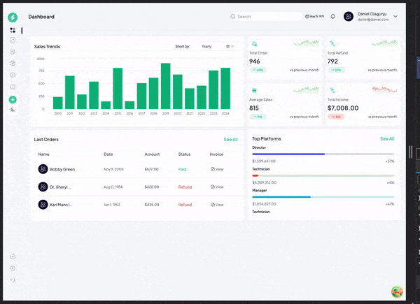

# Dashylytics

A streamlined app designed to provide a comprehensive analytics dashboard. It offers real-time data visualization, helping users track key metrics, understand trends, and make data-driven decisions with ease.



## LightHouse Score

Coming soon

## URL

https://dashlytics.vercel.app

## Built with

- ⚡️ Next.js 13
- ⚛️ React 18
- ✨ TypeScript
- 💨 Tailwind CSS 3
- ✨ Redux toolkit
- ✨ React Query
- ✨ React-Redux
- ✨ Tremor React Library
- 🃏 Jest — Configured for unit testing

## Screens/Pages

This is a pxel-perfect and responsive single page dahsboard where a user can have an overview of Sales, income etc. Users can:

- Toggle between light `☀️` and dark `🌙` mode using their respective buttons on the sidebar
- Hover over any of the sidebar items. Upon Click will get a snakbar notification if screen/feature is in development.
- Change the Sales Trend based on the trend options `weekly`, `monthly`, `yearly` and see realtime change in the bar chart.

## Features

This project implements the following features:

- 💎 Theme: This feature was larlely implemented using `next-theme` and `@tremor/react` libraries which allow seamless implementation of the feature as `tremor` was integrated with `tailwindcss` to achieve dark and light mode options for all components.
- 💎 Charts: Using `@tremor/react` chart components of `BarChar`, `ProgressBar` and others. Pixel perfect components.

- 💎 Dynamic Data Handling: The data used in this project generated in real time including `names`, `date` and `chart data` using `faker` library. See `src/app/constants/<component>` file .e.g. `src/app/constants/sales.tsx` to see how sales trend data is generated in realtime.

- 💎 User Experience/ Interactivity: To acccount for screen/features not implemented, potential user activity anticipated have been handled to return some messages as snackbar. e.g. on Click any of the sidebar menu apart from the logo and the theme icons would render a snack bar message `Oops! 🚧 This feature is still under construction. Please check back soon! 😊`.
- 💎 Mobile Responsiveness: This dashboard is very responsive on any screen ranging from small screen sizes to extra large screens. Moreso, the sidebar can toggled to show on mobile screens without having to disrupt the Dashboard UI. See image below
  

## Getting Started

To run this project locally, you will need to have Node.js, preferably version 20, npm, and TypeScript installed on your machine.

## Installation

Clone this repository to your local machine:

```
git clone https://github.com/todak2000/Dashlytics.git

```

Navigate to the project directory and install the dependencies:

```
cd Dashlytics
yarn install
```

## Development

Jest was used to implement unit Tests. see `__tests__` to run full test on all components. Run the following command:

```
yarn test
```

For specific components. Run the following command:

```
yarn test __tests__/unit/<TESTFILE>
```

e.g.`yarn test __tests__/unit/NotFound.test.tsx` where `<TESTFILE>` = `NotFound.test.tsx`.

## Development

To start the development server, run the following command:

```
yarn dev
```

The website will be available at http://localhost:3000.

## Deployment

This app was deployed to vercel

## License

This project is licensed under the MIT License - see the LICENSE file for details.

## Author

Made with ♥ by [Daniel Olagunju](https://github.com/todak2000) [](https://twitter.com/todak)

---
